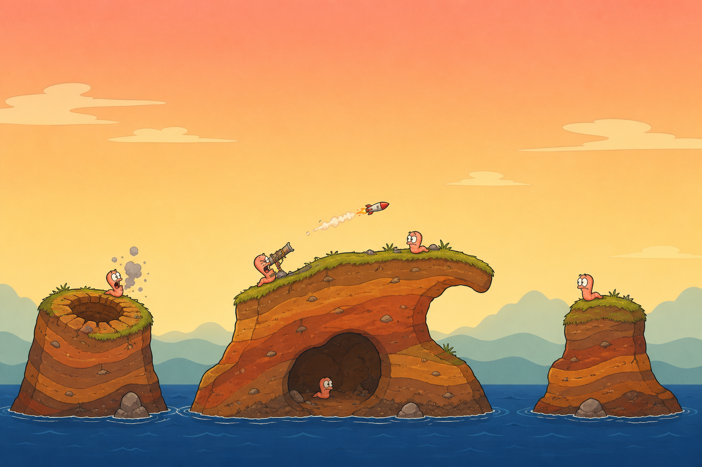
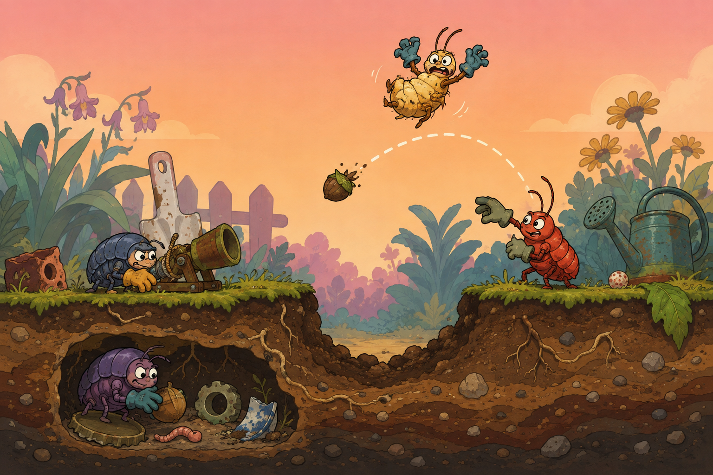

# 2D artillery visual studies

**Status:** Proposed concept illustrations only. These are not gameplay footage, gameplay screenshots, finished production assets, or evidence of implemented features.

## Selected composition study



**Direction:** Small, legless cartoon worms on a wide side-on battlefield, broad island silhouettes, a cave, a crater, water and ample aiming sky. This is the working composition direction following the classic 2D artillery reference.

**Production follow-up:** Design distinct final worm faces and proportions, flatten the decorative terrain top faces into a strict collision silhouette, tune actual camera scale and team count, and implement the playable terrain, animation and UI. The generated image is a composition study, not an exact gameplay or asset specification.

**Created:** 2026-09-05
**Method:** OpenAI built-in image generation tool, new image generation, no input reference images.
**Use case:** `stylized-concept`
**Output:** `classic-2d-battlefield.png`, 1536 × 1024.

### Exact generation prompt

```text
Use case: stylized-concept
Asset type: Original 2D battlefield composition study for a proposed browser artillery game; concept illustration only, not gameplay footage or a finished game.
Primary request: A polished fully flat hand-drawn 2D cartoon artillery battlefield shown as a wide playable-looking map overview, with small original WORM-shaped characters and exceptionally readable island terrain silhouettes.
Scene/backdrop: Three differently sized earthy islands rise out of a clearly visible deep blue waterline in the bottom fifth. The large middle island has a grassy rising ridge, a curved arch and an underground cave in its exposed soil cross-section; one side island contains a fresh round crater. Layered earth strata, sparse root marks and occasional little stones. Big clear warm dusk sky above, with only faint distant flat illustrated cloud and hill layers. Terrain and empty aiming sky dominate the composition.
Subject: SIX tiny original cartoon WORMS stand at different tactical positions across the islands and cave. Each worm is truly legless, with a soft long curved segmented body, a small expressive face, simple dot pupils and its own original proportions. Their curved silhouettes are instantly identifiable as worms at a glance. Each character is only approximately 4 percent of the total image height, so the map is the star. One worm bends to aim a tiny junk-built rocket tube; one recoils in comic surprise beside a small smoke puff; the others lean, peek or wait with lively expressive squash-and-stretch body poses. A single tiny rocket with a short smoke trail travels over a gap.
Style/medium: Fully 2D hand-drawn cartoon game composition study, crisp confident contour lines, flat colors, modest cel shadows and lightly painted earth texture. Nostalgic late-1990s 2D artillery charm with clean modern readability. Original legless worm characters, whimsical and charming, no exact franchise character likeness.
Composition/framing: 1536x1024 landscape, strict flat side elevation with no perspective and no visible top planes. Broad readable terrain shapes occupy the lower half; generous empty aiming sky occupies the upper half. Tiny character scale, camera pulled far back, all terrain islands and waterline fit in frame. This is a battlefield layout study, not a character poster.
Color palette: Illustrated terracotta and ochre earth, muted fresh green grass rims, dusk peach and cream sky, desaturated teal distant layers and deep blue water. Clear value separation.
Constraints: Entirely original art. No text, letters, logos, labels, interface, HUD, health bars, numbers, watermarks, franchise character designs or copied exact faces. No full trajectory line or dotted aiming arc. No gore.
Avoid: Insect legs, caterpillar legs, arms, insect armor, shells, antennae, pill bugs, large foreground characters, mascot portraits, close-up characters, guns as central focus, 3D rendering, glossy shading, clay models, perspective, isometric camera, dioramas, photorealism or volumetric lighting.
```

## Exploratory palette study



**Role:** Retained for its warm illustrated palette, earthy texture and expressive comic energy. Its armored insect-like characters, foreground character scale and full dotted arc are exploratory details and are not the selected worm design or gameplay composition.

**Created:** 2026-09-05
**Method:** OpenAI built-in image generation tool, new image generation, no input reference images.
**Use case:** `stylized-concept`
**Output:** `garden-skirmish.png`, 1536 × 1024.

### Exact generation prompt

```text
Use case: stylized-concept
Asset type: Original visual direction illustration for a proposed 2D browser artillery game; concept art only, not an actual gameplay screenshot.
Primary request: A beautiful fully flat side-on 2D illustrated garden artillery battlefield, combining nostalgic late-1990s cartoon game charm with crisp modern silhouettes and painterly material detail.
Scene/backdrop: A horizontal terrain cross-section stretches across the image, with rolling grassy platforms, an open crater and a tunneled cavity cut into visibly layered earth, roots and pebbles. A pastel dusk sky gradient and two distant flat illustrated garden parallax layers give atmosphere. Small garden junk props supply playful cover.
Subject: Three entirely original small segmented garden invertebrate combatants with squat unique shapes, bean-shaped faces, expressive eyes and oversized gardening gloves. One crouches with a garden junk launcher; one has just tossed a seed grenade following a curved dotted illustrative arc; a third is airborne above the crater in a startled squash-and-stretch cartoon pose. Strong visual separation makes the action instantly readable.
Style/medium: Fully 2D hand-drawn cartoon game concept illustration. Clean confident outlines, simple flat colors, restrained painterly surface marks and subtle flat cel shadows. Expressive original characters, cozy setting, playful tactical chaos.
Composition/framing: Wide 1536x1024 landscape. Strict orthographic side elevation; no perspective, no visible terrain top planes. Side-on cutaway soil fills the lower half; action has generous clear sky above. Readable terrain silhouettes at a glance.
Lighting/mood: Illustrated warm peach dusk with cool teal shadow color accents, cheerful comic energy.
Materials/textures: Flat painted earthy strata, little root squiggles and stones, simple illustrated fabric gloves, worn garden equipment and leaves.
Constraints: Entirely original character and prop designs. No logos, text, letters, labels, interface, watermark, branded imagery, recognizable franchise characters or imitated character designs. No gore. This is concept art for a game that has not been built.
Avoid: 3D rendering, clay models, diorama, isometric camera, perspective terrain, photorealism, physically based lighting, glossy materials, depth of field, volumetric shading.
```

## Provenance and privacy

Both generated images retain their embedded provenance metadata. Their prompts contain no personal information or machine-specific paths. PNG metadata was checked for machine-specific user paths and known personal identifiers before inclusion; no checked identifiers were found.
